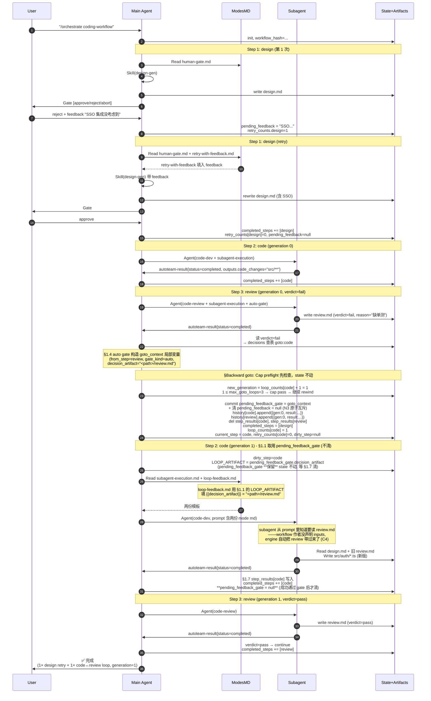
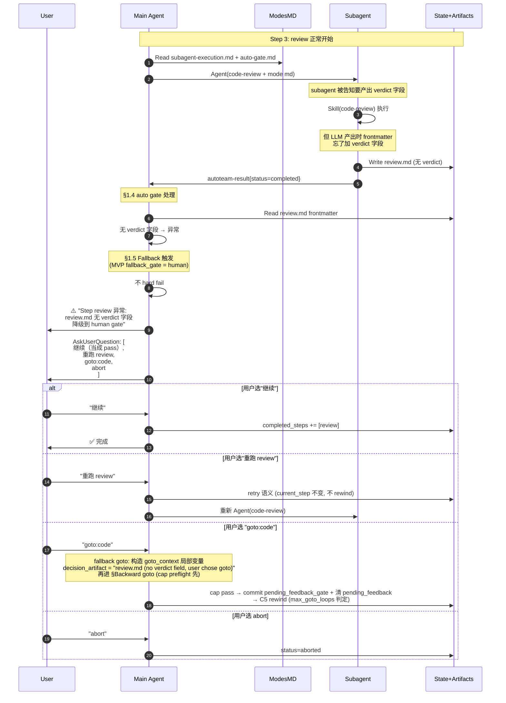
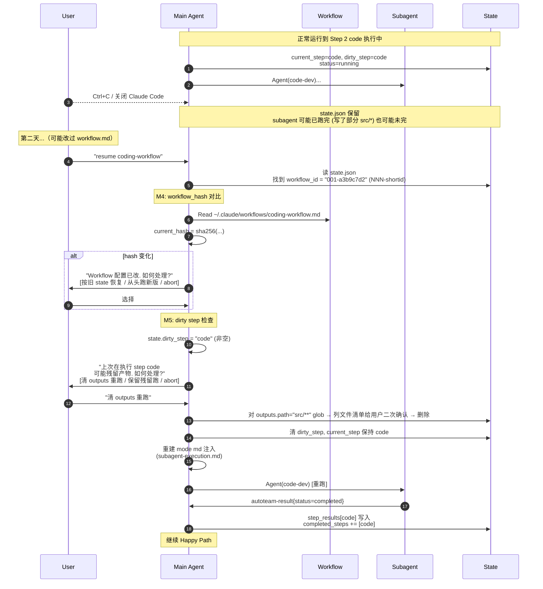
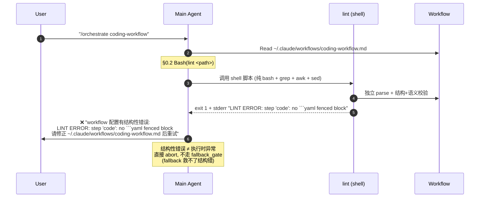

# 执行时序图

本文档用时序图展示 `coding-workflow` 的典型执行路径，辅助理解 `skill-orchestrator` 运行时的实际形态。涵盖：workflow 是配置不是 skill、对话文本注入参数、autoteam-result schema 由 engine 所有、Backward goto rewind + generation 计数、Loop feedback 自动注入、Resume workflow hash + dirty step 检查、路径三写法、厚 shell lint、Loop feedback 两字段互斥 + cap preflight。

## 角色

| 角色 | 描述 |
|---|---|
| **User** | 用户，在 Claude Code 主会话里输入 |
| **Main Agent** | Claude Code 主会话里的 agent（workflow 的唯一驱动者）——加载 `skill-orchestrator` 后扮演 engine 角色 |
| **Subagent** | 通过 Agent 工具派发的后台 subagent（无状态执行者） |
| **ModesMD** | `~/.claude/skills/skill-orchestrator/modes/*.md`（模式说明模板） |
| **Workflow** | `~/.claude/workflows/<name>.md`（engine 读的配置文件，**不是 skill**） |
| **State** | `<项目根>/.autoteam/<workflow_id>/state.json`（唯一事实来源）；`workflow_id = NNN-<shortid>` |
| **Artifacts** | 产物文件（design.md、src/*、review.md 等） |

---

## 场景 1：Happy Path（无 reject、无 loop、无 fallback）

```mermaid
sequenceDiagram
    autonumber
    participant U as User
    participant M as Main Agent
    participant W as Workflow
    participant D as ModesMD
    participant S as Subagent
    participant F as State+Artifacts

    U->>M: "/orchestrate coding-workflow feature_name='JWT 认证'"<br/>或 "跑 coding-workflow 实现 JWT 认证"
    Note over M: engine description 高触发<br/>Claude 加载 skill-orchestrator
    M->>W: Read ~/.claude/workflows/coding-workflow.md
    Note over M: 0.2 Bash(lint <path>)<br/>覆盖结构层+语义层; 失败→abort+stderr notify
    Note over M: 0.2 YAML parse 每个 step (LLM, lint 不做)
    M->>F: 0.3 init state.json<br/>workflow_id=001-a3b9c7d2 (扫 .autoteam/ 取 max NNN+1)<br/>workflow_hash = sha256(workflow.md)<br/>workspace.root = <cwd>/.autoteam/001-a3b9c7d2

    Note over M,F: ═══ Step 1: design (mode=main, gate=human) ═══
    M->>F: state.current_step=design<br/>state.dirty_step=design
    M->>D: Read modes/human-gate.md
    D-->>M: 模板内容
    Note over M: C3: engine 在主会话输出对话文本:<br/>"现在要执行 design-gen skill<br/>参数: feature=JWT, language=typescript<br/>期望产物: .../artifacts/design.md"
    M->>M: Skill(design-gen, args="")<br/>（args 留空，参数在对话上下文）
    M->>F: 主 agent 写 artifacts/design.md
    M->>U: AskUserQuestion [approve/reject/abort]
    U->>M: approve
    M->>F: completed_steps += [design]<br/>dirty_step=null, retry_counts[design]=0

    Note over M,F: ═══ Step 2: code (mode=subagent, no gate) ═══
    M->>F: current_step=code, dirty_step=code
    M->>D: Read modes/subagent-execution.md
    D-->>M: 含 autoteam-result 块规范的 subagent 契约
    M->>M: 构造 subagent prompt<br/>(填 inputs/outputs/prompt_args + 注入 mode md)
    M->>S: Agent(general-purpose, prompt=...)
    S->>F: Read artifacts/design.md
    S->>S: Skill(code-dev) 加载执行
    S->>F: Write src/auth/*.ts
    Note over S: 回复末尾按 engine 固化的 schema 输出:<br/>---autoteam-result---<br/>status: completed<br/>outputs: {code_changes: "src/**"}<br/>summary: "..."
    S->>M: 返回
    M->>M: C1: 解析 autoteam-result 块<br/>验证 outputs 文件存在
    M->>F: step_results[code]=...<br/>completed_steps += [code]

    Note over M,F: ═══ Step 3: review (subagent + auto gate) ═══
    M->>D: Read modes/subagent-execution.md + auto-gate.md
    Note over M: auto-gate 告诉执行者: <br/>产出里必须有 verdict 字段
    M->>S: Agent(code-review, prompt=...)
    S->>F: Read design + src/
    S->>S: Skill(code-review) 执行
    S->>F: Write review.md (frontmatter.verdict=pass)
    S->>M: autoteam-result{status=completed}

    M->>F: 读 review.md frontmatter.verdict<br/>(MVP: 根级字段 + case-sensitive)
    M->>M: 值=pass → decisions 查表 continue
    M->>F: completed_steps += [review]<br/>status=completed, loop_counts 清空
    M->>U: ✅ Workflow 完成
```

---

## 场景 2：Reject retry + Auto gate Loop（展示 C4 + C5）



**关键观察**：
- **C5 rewind**：goto:code 后 completed_steps 截断、step_results 搬到 history[generation]、loop_counts++
- **C4 auto inject**：workflow-example.md 里 code step 的 `inputs` 只声明了 design_doc，**没声明 review.md**——engine 自己在 pending_feedback_gate 驱动下把 review 追加到 code 下次执行的 prompt。workflow 作者完全不关心 loop feedback 语义
- **N3 取用延迟清**：§1.1 只 copy 到局部 `LOOP_ARTIFACT`（不动 state）；§1.7 step 成功通过 gate 时才 `pending_feedback_gate = null`。好处：§1.3/§1.4 中间崩溃 resume 后能重新注入 feedback（不会静默丢）
- **N4 loop cap**：顶层 `max_goto_loops: 3`（见 workflow-example frontmatter）管这个 goto——计数器 `loop_counts[code]` 到 3 时下一次 goto:code 会 fallback to human（不 hard fail）

---

## 场景 3：Fallback 触发（auto gate 字段读失败 → 降级 human）



**关键点**：
- 任何执行时异常（subagent 无 autoteam-result / auto gate 字段读失败 / outputs 未出现 / mode md 读失败 / loop 超 `max_goto_loops`）统一走这条路径
- Engine 对 skill 产出**零硬校验**——LLM 不稳定是生活的一部分
- Fallback_gate MVP 只允许 `human`，保证用户总是兜底决策者
- 用户"继续"分支意味着 **即使产出不合规，workflow 也不会卡死**

---

## 场景 4：中断与恢复（含 workflow hash + dirty step 检查）



**MVP 恢复策略**：
- **粒度**：step 级重跑（不尝试 step 内恢复——那是 skill 作者的事）
- **workflow_hash**：防止用户改过 workflow.md 后按旧 state 跑错
- **dirty_step**：上次崩溃时正在 §1.3 的 step，resume 前问用户清不清残留
- **外部副作用 skill** 不在 MVP 保证范围——重跑可能导致 API 调两次、消息发两遍

---

## 场景 5：结构性异常（lint 启动时失败）



**lint 覆盖的错误类别**（shell 脚本，零依赖）：
- **结构层**：缺 `## Steps` / H3 下无 yaml / 多 yaml block / yaml 未闭合 / id 重复 / 顶层必填（name/description/autoteam_version）缺失 / name≠文件名 / fallback_gate≠human / max_goto_loops 非正整数 / **BOM 自动 strip**
- **语义层**：
  - **必填 step 字段**：skill / mode / on_fail；若 `gate_after` 存在则 `kind` 必填
  - **值合法性**：skill 对应 `~/.claude/skills/<name>/SKILL.md` 存在 / mode∈{main,subagent} / gate_after.kind∈{human,auto} / on_fail 格式 / decision.field 非嵌套 / goto 目标存在
  - **`{{params.X}}` 引用 X 在 frontmatter params 第一级缩进 key 中声明**（不把 `type`/`required`/`default` 误当 param 名）

**lint 不覆盖**（交 engine §0.2 LLM parse 时发现）：YAML 语法错（缺引号、缩进错、anchors 坏）

**MVP 限制**（lint 主动拒绝并报清晰提示）：inline `params: {...}` flow-map 不支持，必须用 block form

---

## 状态机

```
                       ┌──────────────┐
                       │ initialized  │
                       └──────┬───────┘
                              │ §0.3 init
                              ▼
              ┌───────────────────────────┐
     ┌───────▶│         running           │◀────┐
     │        │  §1.1 准备                 │     │
     │        │  §1.2 Mode md 注入         │     │
     │        │  §1.3 按 mode 执行          │     │ resume
     │        │  §1.4 Gate / §1.5 Fallback │     │ (§3)
     │        │  §1.6 on_fail              │     │
     │        │  §1.7 成功完成              │     │
     │        └───────┬───────┬────────────┘     │
     │                │       │             ┌────┴─────┐
     │             approve  reject ─retry   │ paused   │
     │                │       ├─goto──┐     └──────────┘
     │                │       └fallback     ▲
     │                │            │         │ Ctrl+C
     │                │            ▼         │
     │                │     [human 兜底决策]  │
     │                │    ┌─ 继续            │
     │                │    ├─ 重跑            │
     │                │    ├─ goto:<X>        │
     │                │    └─ abort           │
     │                │                       │
     │                │                       ▼
     │                │                  ┌──────────┐
     │                │                  │ failed / │
     │                │                  │ aborted  │
     │                │                  └──────────┘
     │                │ all steps done
     │                ▼
     │           ┌──────────┐
     │           │completed │
     │           └──────────┘
```

---

## 关键观察

1. **Workflow 是配置不是 skill**——`~/.claude/workflows/<name>.md` 文件；engine 才是唯一 skill
2. **Main Agent 是 workflow 的唯一驱动者**——它读 state、读 workflow、Read mode md、注入、执行、写 state
3. **Subagent 是无状态执行者**——按接到的 prompt（含 mode 说明）跑 skill；**engine 通过 mode md 告诉它 autoteam-result 块怎么写**（schema 在 engine 所有，skill 零感知）
4. **Main 模式参数通过对话文本传**（C3）——不通过 Skill args 序列化；engine 在调 Skill 前声明参数给主 agent 看，skill 从上下文读
5. **C4 Loop feedback engine 自动注入**——goto 回跳时 engine 把 gate decision artifact 带给下次执行者，workflow 作者**不用在 inputs 声明**
6. **C5 State rewind**——goto 跳回 target：history[generation] 保存旧 step_results、completed_steps 截断、loop_counts[target]++
7. **N1 路径三写法**：`{{workspace.root}}/...` = workflow 内部 artifact（落 `<cwd>/.autoteam/<workflow_id>/`）/ 相对路径 = 项目根相对 / 绝对路径。glob state 只存字符串（单值或 pattern），skill 自己 glob 展开
8. **N2 lint = shell 脚本**：纯 bash + grep + awk + sed 零依赖；覆盖结构+语义；两个时点调用（creator 生成后 / engine §0.2 首步）
9. **N3 Loop feedback 两字段互斥**：`pending_feedback`（retry 路径）vs `pending_feedback_gate`（goto 路径），按 `on_reject` 分叉选一个；模板变量统一 `{{decision_artifact}}`；target step §1.1 只**取用**到局部 `LOOP_ARTIFACT`（不动 state），§1.7 成功通过 gate 才清 `pending_feedback_gate`（，crash resume 能重消费）
10. **N4 goto cap 顶层统一**：`max_goto_loops`（默认 10）所有 goto 分支共用；超 cap → fallback to human
11. **ModesMD 是行为数据层**——改 md 能改行为，engine 代码不动
12. **Fallback 贯穿所有执行时异常**——MVP `fallback_gate=human`，永不 hard fail
13. **结构性错误 ≠ 执行时异常**——lint / 0.2 任一失败 → abort + 精确定位，不走 fallback
14. **State 是唯一事实来源**——workflow_hash 防 resume 错配、dirty_step 防残留污染
15. **保证范围**：本地文件产物 / 可重跑 skill；外部副作用 skill 用户自负

---

## 和核心机制的对应

| 执行步骤 | 对应机制 | 变化来源 |
|---|---|---|
| §0.2 lint（厚 shell） | 启动前结构+语义校验（零依赖） | |
| §0.2 outputs.path 三写法 | 路径语义 | |
| §0.3 workflow_id = NNN-shortid | 工作区管理 | **** |
| §1.2 Mode md 注入 | 运行时 prompt 注入 / skill 零感知 | 保留 |
| §1.3 main 对话文本注入参数 | C3 | |
| §1.3 subagent autoteam-result 解析 | C1 schema 固化在 engine | |
| §1.1 取用 pending_feedback_gate（不清）+ §1.7 成功后清 | **N3 两字段互斥 / 取用-延迟清** | ** + ** |
| §1.2 loop-feedback.md 用 LOOP_ARTIFACT 注入 | C4 |  +  N3 |
| §1.4 human reject 按 on_reject 分叉 pending_feedback / pending_feedback_gate（切换时原子清对方字段） | **N3 字段互斥 + 原子切换** |  + ** 互斥闭环** |
| §1.4 Backward goto rewind + `max_goto_loops` 统一 cap | C5 + **N4** |  +  |
| §1.4 Backward goto **Cap preflight**（超 cap 不改 pre-goto state / goto_context 延迟提交） | fallback 语义一致 + pre-goto state 不污染 | **** 修正  ordering bug |
| §1.4 Backward goto commit 同时清 pending_feedback | N3 互斥覆盖 retry→fallback→goto 切换 | **** |
| §1.5 Fallback（含 fallback_context 传递） | 异常降级 / 永不 hard fail / cap 超限 artifact 不丢失 | fallback_gate MVP 仅 human + ** fallback_context** |
| §1.7 清 pending_feedback（retry 成功 + skip 分支） | N3 互斥闭环 | **** |
| §3 workflow_hash / dirty_step | M4 / M5 | |
| §1.6 on_fail | 失败三态 |  保留 |
| §1.7 retry/loop counts | 循环控制 | retry 按本 step 清、loop 按 target step |
| 全程串行 | 纯串行 |  保留 |
